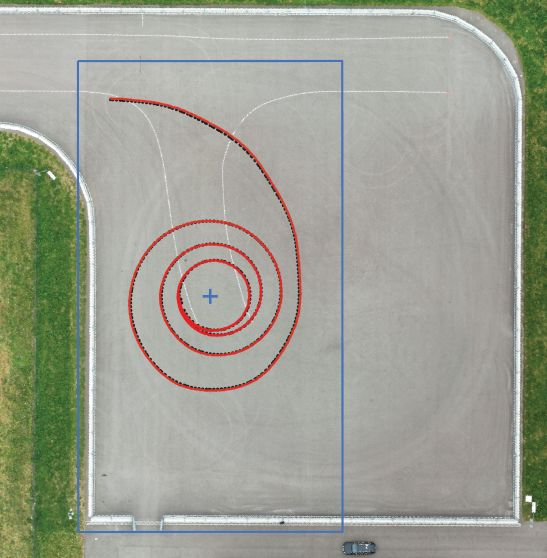
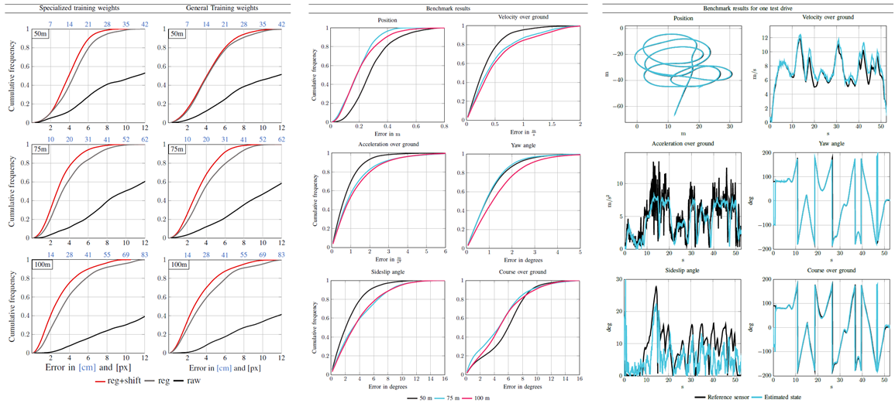
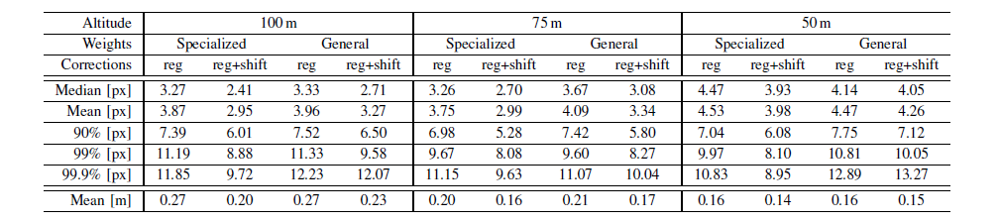
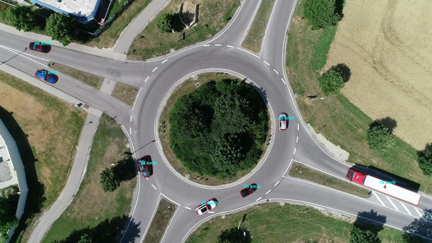

# Vehicle Detection and State Estimation with Aerial Imagery

This is the Code and data supplemented with the following publications:

* [Vehicle Position Estimation with Aerial Imagery from Unmanned Aerial Vehicles](http://arxiv.org/abs/2004.08206) (1)
* Accuracy Characterization of the Vehicle State Estimation from Aerial Imagery (2)
* Both are published at the [2020 IEEE Intelligent Vehicles Symposium (IV)](https://2020.ieee-iv.org/)


The repository includes:
* Pre-Processing: Images from Video, Image Registration etc.
* Vehicle Detection: source code of Mask R-CNN built on FPN and ResNet101 from 
* Pre-trained weights: To reproduce the results fromt he publications or to directly apply to your own data set
* Post-Processing: Generate Bounding Boxes, Perform Tracking, estimate vehicle state variables as position, speed, acceleration and orientation
* Data to evaluate the benchmark peformed against an industrial-grade reference sensor (see publications)
* Plot results: Visualize the bounding boxes and state variables on the images and crate a video
* Description and example on how to apply transfer learning to improve your data set results
* Example data used for the publications, see below 

### Here is one example from the benchmark experiments:

<p align="center">
  
</p>

The figure depicts an bird's eye view on an orthorectified map of the test track at 50 m flight altitude. 
Depicted is the trajectory of the reference in black and drone in red, respectively. 
The car was driven in spirals to capture different vehicle poses and positions in the image frame. 
The blue rectangle and cross indicate the image frame and center. For estimation purposes, a true-to-scale T-junction is painted white on the test track.

# What is the purpose of this repository?
Citing from the abstract of publication (1):\
The availability of real-world data is a key element for novel developments in the fields of automotive and traffic research. 
Aerial imagery has the major advantage of recording multiple objects simultaneously and overcomes limitations such as occlusions. 
However, there are only few data sets available. This work describes a process to estimate a precise vehicle position from aerial imagery. 
A robust object detection is crucial for reliable results, hence the state-of-the-art deep neural network Mask-RCNN is applied for that purpose. 
Two training data sets are employed: The first one is optimized for detecting the test vehicle, while the second one consists of randomly selected images recorded on public roads. 
To reduce errors, several aspects are accounted for, such as the drone movement and the perspective projection from a photograph. 
The estimated position is comapared with a reference system installed in the test vehicle. It is shown, that a mean accuracy of 20 cm can be achieved with flight altitudes up to 100 m, Full-HD resolution and a frame-by-frame detection. 
A reliable position estimation is the basis for further data processing, such as obtaining additional vehicle state variables. 

Citing from the abstract of publication (2):\
Due to their capability of acquiring aerial imagery,
camera-equipped Unmanned Aerial Vehicles (UAVs) are very
cost-effective tools for acquiring traffic information. However,
not enough attention has been given to the validation of the
accuracy of these systems. In this paper, an analysis of the
most significant sources of error is done. This includes three
key components. First, a vehicle state estimation by means
of statistical filtering. Second, a quantification of the most
significant sources of error. Third, a benchmark of the estimated
state compared with state-of-the-art reference sensors. This
work presents ways to minimize the errors of the most relevant
sources. With these error reductions, camera-equipped UAVs
are very attractive tools for traffic data acquisition. 

# Which accuracy can be expected?
The figure below depicts the error curves we obtained from the experiments in the publications.
For further information check the publications.

	

Here is a detailed Table with position error results from publication (1): \


# Getting started
* [main.m](samples/vehicle_detection/) is the example file. Define either you want to train the network or apply the detection with provided training weights.
For detection, you can start from a video source (example provided in this repository) and the Matlab Code generates images and performs the image registration. Alternatively, start with the provided image data set from the publication and adapt the file source in the main file.

* [pre_processing](samples/vehicle_detection/pre_processing) includes the code to generate images from videos and perform image registration. Both can be executed within a GUI or via command line. To 
run the GUI, just open the `*.m` file in Matlab and run it, then the GUI window opens.

* [startPostProcess.m](samples/vehicle_detection/post_processing) is the right start, if you performed the detection and computed the bounding boxes already - or you take the output files provided from the publication. 
It includes the tracking (vehicle ID assignment, Kalman-Filter) and outputs the vehicle state variables. You can vizualize the error plots or create a new video including the bounding boxes and additional information.

* [_positionData](samples/vehicle_detection/_positionData) provides the data sample from the publication to run the post-processing. If you want to run the video, download the corresponding [image data set](https://faubox.rrze.uni-erlangen.de/getlink/fiU4TAFUx95npBKD9YQxYbai/IEEE_IV_2020_images_example.zip)  set as well.

# Installation
1. Clone this repository
2. Install dependencies
   ```
   pip install -r requirements.txt
   ```
3. Run setup from the repository root directory
    ```
    python setup.py install
    ``` 
4. Download our [weights](https://faubox.rrze.uni-erlangen.de/getlink/fi9eQZnv9iotEBsBUHN17j6z/mask_rcnn_car_0400_791imgs_200312.h5) and store them in the [logs](logs) folder.
5. Optional: Download pre-trained COCO weights from the . Choose `Mask R-CNN 2.0` and click on `Assets` to download the weights (mask_rcnn_coco.h5). This is useful, if you want to start your own training from the coco weights.

# Example data and training weights
One example video is already included in this repository ([DJI_0029_example.mp4](datasets/vehicle_detection)). The [main.m](samples/vehicle_detection/) script is set to this video.
For further data, i.e. pre-trained weights, the labeled data of the test vehicle or one complete video from the paper data set,
download the data  hosted on the [FAU University](https://www.fau.eu/) server: 
* [Example Video Frames from Publication (1)](https://faubox.rrze.uni-erlangen.de/getlink/fiU4TAFUx95npBKD9YQxYbai/IEEE_IV_2020_images_example.zip) 
* [Labeled training data set](https://faubox.rrze.uni-erlangen.de/getlink/fi2x2oaNQfM55UgBP2YBB6Vp/IEEE_IV_2020_LabelData_only_A4.zip)
* [Weights, trained on Full HD with 791 images](https://faubox.rrze.uni-erlangen.de/getlink/fi9eQZnv9iotEBsBUHN17j6z/mask_rcnn_car_0400_791imgs_200312.h5)

# Apply your own training 
If you want to increase the detection performance, create a labeled training data set and apply transfer learning. \
The easiest way to start is by annotating the data using the open sourced [VIA Image Annotator](http://www.robots.ox.ac.uk/~vgg/software/via) . \
To get started with an example, check our [provided labeled data set](https://faubox.rrze.uni-erlangen.de/getlink/fi2x2oaNQfM55UgBP2YBB6Vp/IEEE_IV_2020_LabelData_only_A4.zip) used for the publictations. \
To create your training data set for transfer learning:
1. Label the images
2. Export your annotations as JSON file and name the file `via_region_data.json`. 
3. Store your training files (images and JSON annotation file) in the [train](datasets/vehDetection/train/) folder. 
4. Train:

```
# Train from COCO data set 
    python vehDetection.py train --dataset=C:\\Mask_RCNN\\datasets\\vehDetection --weights=coco 

# Train from our weights
    python vehDetection.py train --dataset=C:\\Mask_RCNN\\datasets\\vehDetection --weights=link\to\weights
```
To change the training procedure, [vehDetection.py](samples/vehicle_detection/) is the file to go.\
For more information, check the well documented repository from .

Here is one processed example image from public roads:

<p align="center">
  
</p>

# Evaluate detection performance with COCO mAP

Run the COCO evaluation code with:
```
# Run COCO evaluation on the last trained model
python vehDetection_evaluate.py evaluation --dataset=C:\Mask_RCNN\datasets\vehDetection --subset=evaluation --weights=last
# Run COCO evaluation on a specified trained model
python vehDetection_evaluate.py evaluation --dataset=C:\Mask_RCNN\datasets\vehDetection --subset=evaluation --weights=link\to\weights
```

Don't forget to copy your data in the evaluation folder and adapt the training weights to your needs.

# Citation

To cite the this repository:
```
@misc{KruberGithub.2020,
 author = {{F. Kruber} and E. {Sanchéz Morales}},
 date = {2020},
 title = {{OpenTrafficMonitoring}},
 journal={GitHub repository},
 url = {\url{https://github.com/fkthi}}
}
```

To cite our publications:
```
@INPROCEEDINGS{KruberIV20,
author={F. {Kruber} and E. {Sanchéz Morales} and S. {Chakraborty} and M. {Botsch}},
booktitle={2020 IEEE Intelligent Vehicles Symposium (IV)},
title={{Vehicle Position Estimation with Aerial Imagery from Unmanned Aerial Vehicles}},
year={2020}
}
```
```
@INPROCEEDINGS{SanchezMoralesIV20,
author={E. {Sanchéz Morales} and F. {Kruber} and M. {Botsch} and B. {Huber} and  A. {García Higuera}},
booktitle={2020 IEEE Intelligent Vehicles Symposium (IV)},
title={{Accuracy Characterization of the Vehicle State Estimation from Aerial Imagery}},
year={2020}
}
```

# Requirements
Matlab and the following Toolboxes: Computer Vision Toolbox, Image Processing Toolbox. (Tested on R2018b and R2019a)\
Python 3.4, TensorFlow 1.3, Keras 2.0.8 and other common packages listed in `requirements.txt`.

The GPU requirements to train on Full-HD: at least 11 GB of RAM on GPU (Tested with 24 GB RAM on GPU)
# Improvements
A long term goal is to replace commercial software dependencies (Matlab) with open source code.

# Acknowledgment
 provided the excellent Mask-RCNN implementation. Please also respect the licenses.

The authors acknowledge the financial support by the Federal Ministry of Education and Research of
Germany (BMBF) in the framework of FH-Impuls (project number 03FH7I02IA).